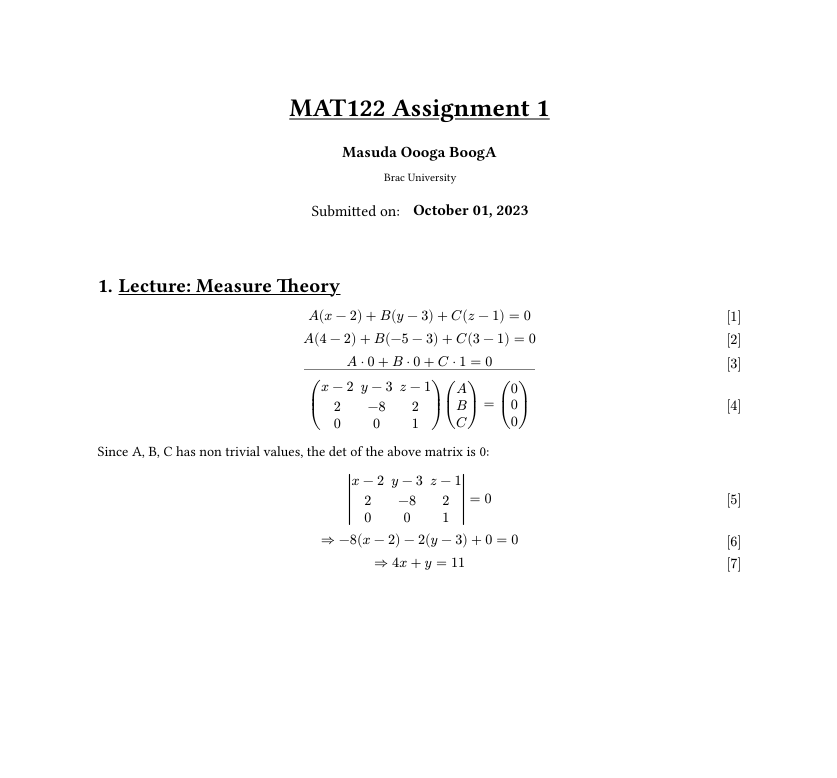
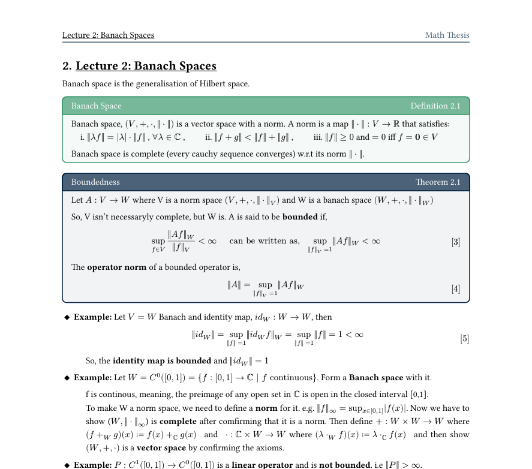

# typst-math-template
Used some part of the template from this [repo](https://github.com/jskherman/jsk-lecnotes).
It looks like this ryt out of the box:

And could use the pretty boxes to make math notes like this too:

